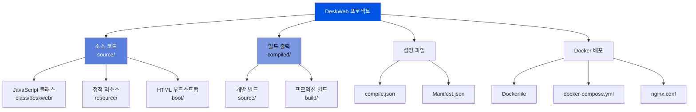
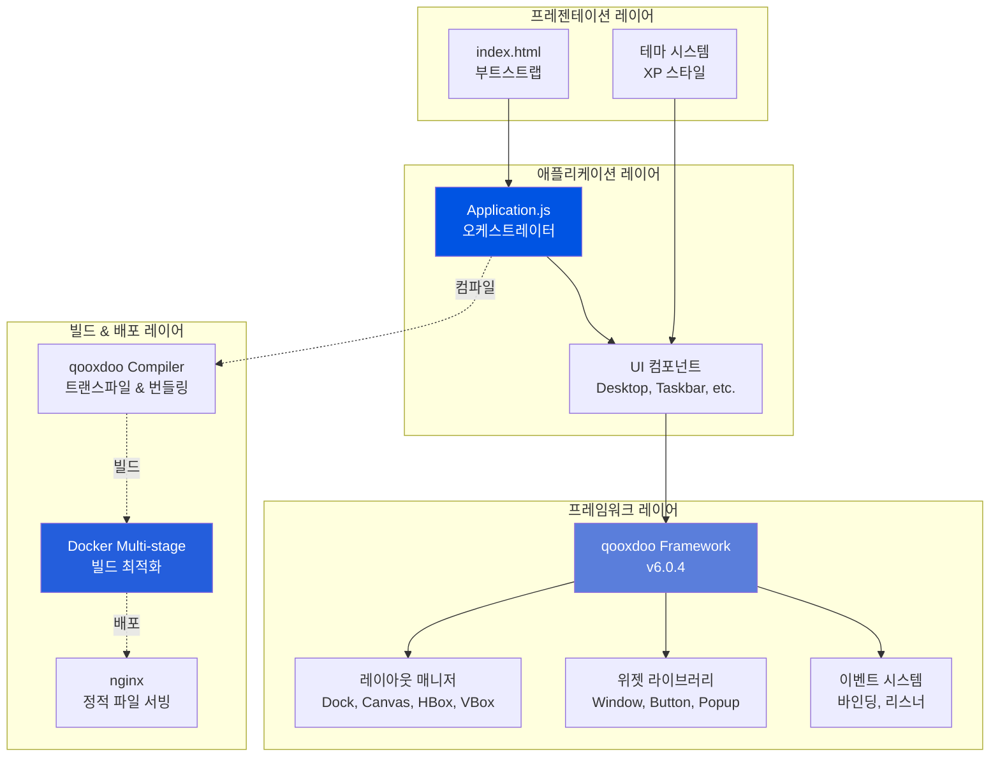
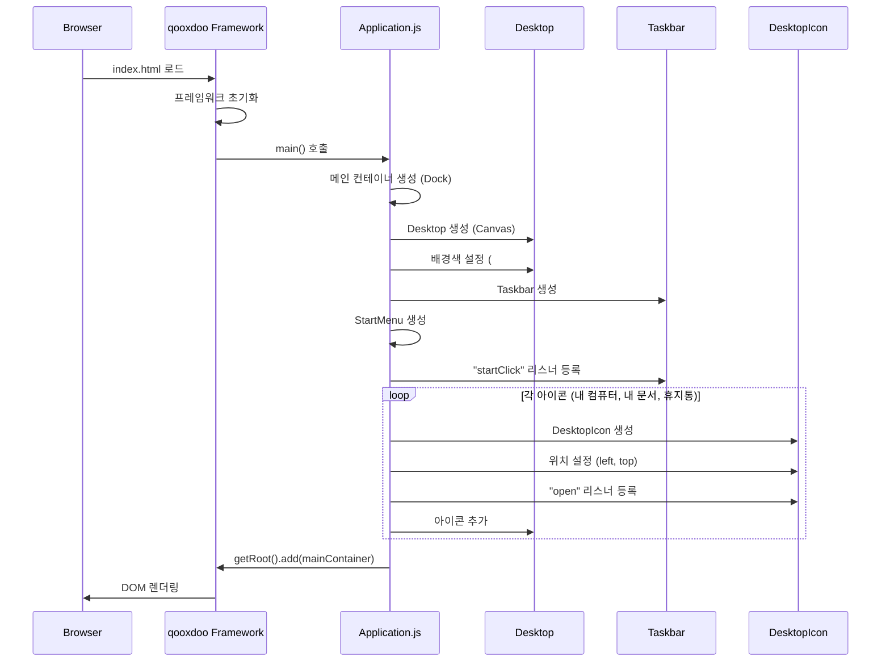
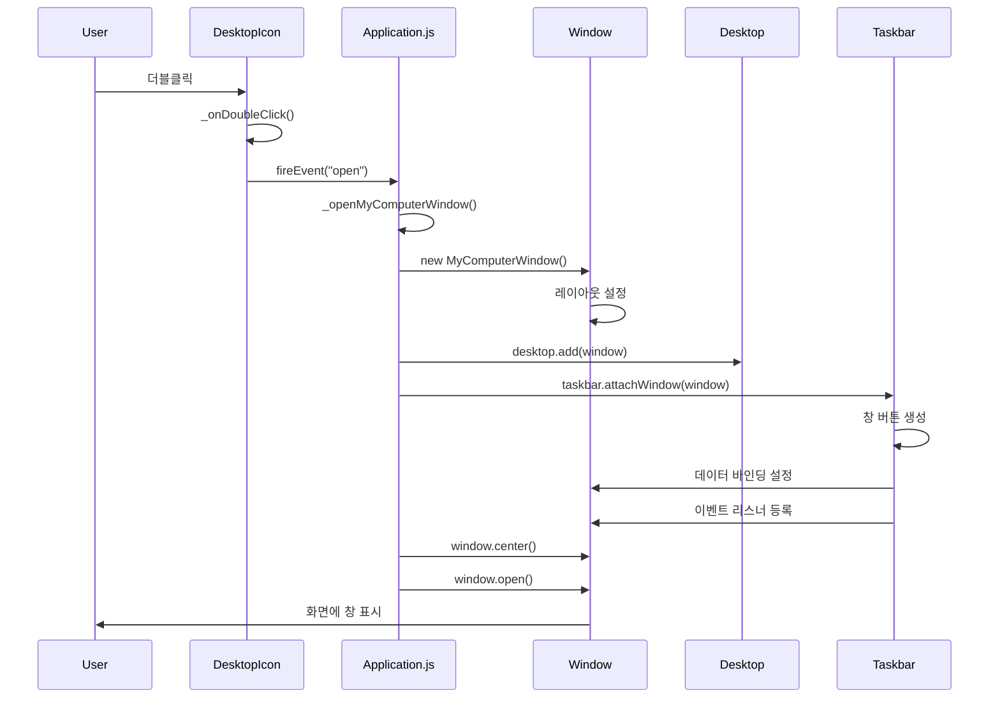
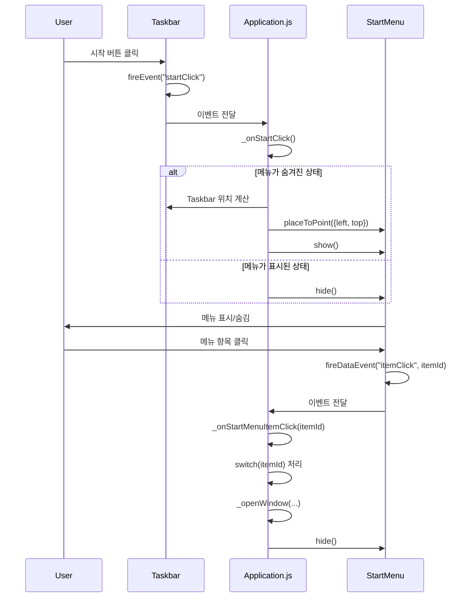
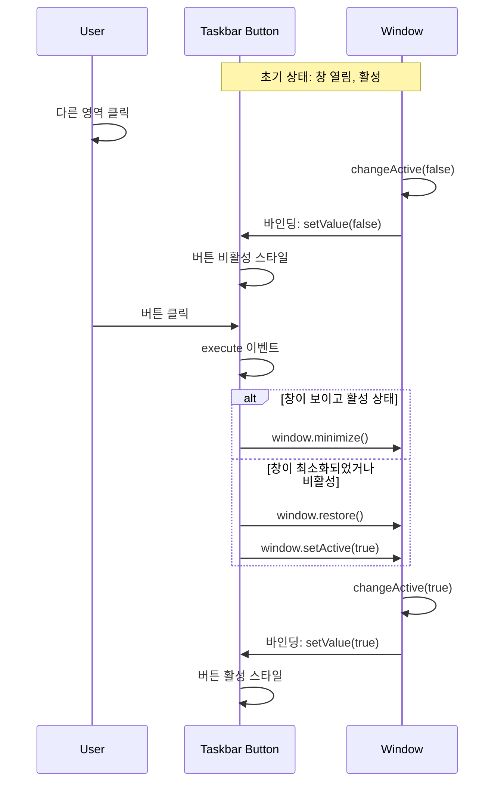
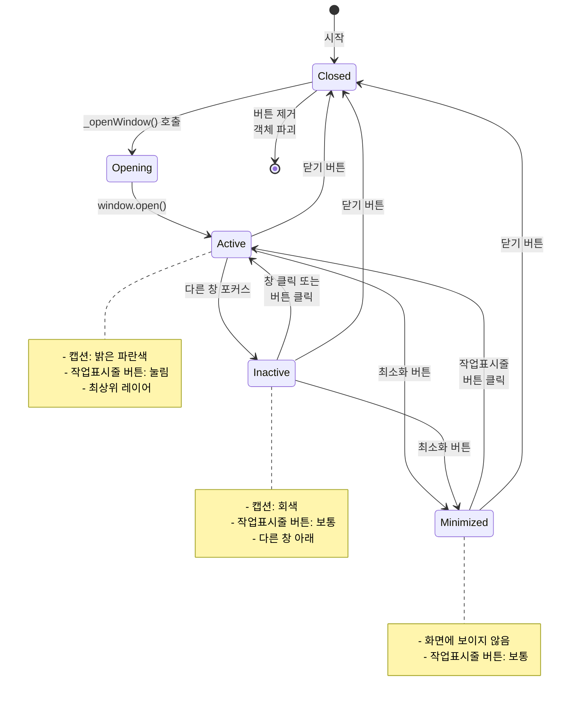
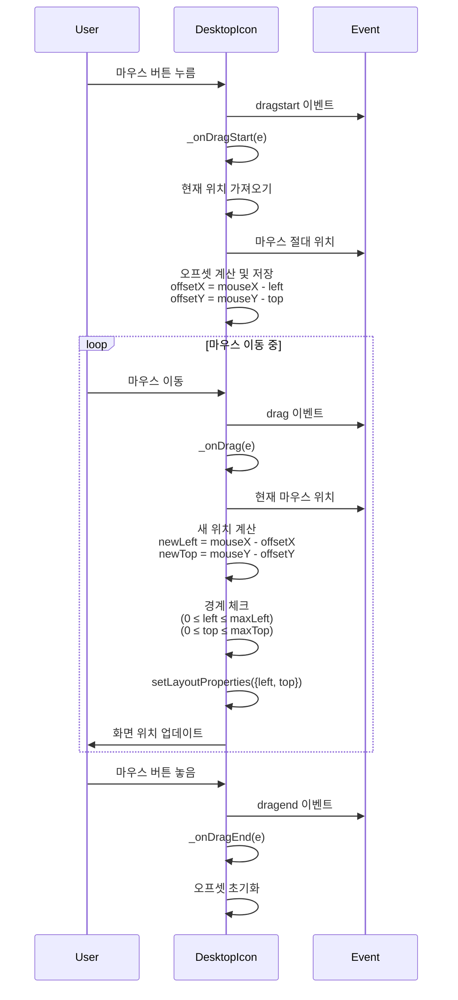
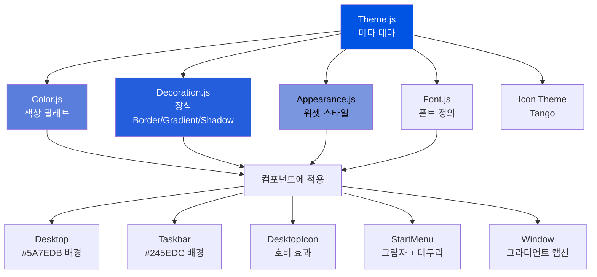
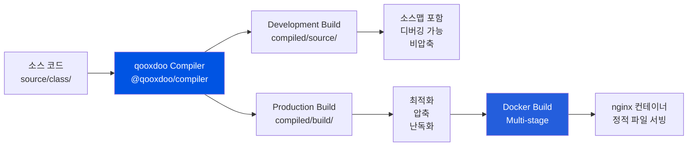

# DeskWeb - 프로젝트 아키텍처 문서

> Windows XP 스타일 웹 데스크톱 환경 - 완전한 기술 문서

---

## 📋 목차

1. [프로젝트 개요](#1-프로젝트-개요)
2. [아키텍처 구조](#2-아키텍처-구조)
3. [핵심 컴포넌트](#3-핵심-컴포넌트)
4. [애플리케이션 흐름](#4-애플리케이션-흐름)
5. [테마 시스템](#5-테마-시스템)
6. [기술 스택](#6-기술-스택)
7. [개발 가이드](#7-개발-가이드)

---

## 1. 프로젝트 개요

### 1.1 프로젝트 정보

**DeskWeb**은 브라우저에서 동작하는 Windows XP 스타일의 데스크톱 환경입니다.

- **타입**: 웹 기반 데스크톱 애플리케이션
- **프레임워크**: qooxdoo v6.0.4+ (엔터프라이즈급 JavaScript 프레임워크)
- **언어**: JavaScript (ES6+)
- **빌드 도구**: @qooxdoo/compiler v1.0.5+
- **배포**: Docker + nginx

### 1.2 주요 기능

✅ **데스크톱 환경**
- 드래그 가능한 데스크톱 아이콘 (내 컴퓨터, 내 문서, 휴지통)
- Windows XP 스타일 바탕화면 (#5A7EDB 블루)

✅ **윈도우 관리**
- 창 열기/닫기/최소화/최대화
- 여러 창 동시 관리
- 활성/비활성 상태 표시

✅ **작업표시줄 (Taskbar)**
- 시작 버튼 및 시작 메뉴
- 열린 창 버튼 (동적 생성)
- 시스템 트레이 (시계 + 달력)

✅ **Windows XP 테마**
- 정통 XP 색상 팔레트
- 그라디언트 효과
- 둥근 모서리 및 그림자

### 1.3 프로젝트 구조 개요



---

## 2. 아키텍처 구조

### 2.1 디렉토리 구조

```
DeskWeb/
├── source/                          # 소스 코드
│   ├── class/deskweb/              # JavaScript 클래스
│   │   ├── Application.js          # 메인 애플리케이션 (진입점)
│   │   ├── theme/                  # Windows XP 테마
│   │   │   ├── Theme.js           # 테마 통합
│   │   │   ├── Color.js           # 색상 팔레트
│   │   │   ├── Decoration.js      # 장식 (그라디언트, 테두리)
│   │   │   ├── Appearance.js      # 위젯 스타일
│   │   │   └── Font.js            # 폰트 정의
│   │   └── ui/                     # UI 컴포넌트
│   │       ├── DesktopIcon.js     # 드래그 가능 아이콘
│   │       ├── Taskbar.js         # 작업표시줄
│   │       ├── StartMenu.js       # 시작 메뉴
│   │       └── MyComputerWindow.js # 내 컴퓨터 창
│   ├── boot/                       # HTML 부트스트랩
│   │   ├── index.html             # 진입 HTML
│   │   └── nojs.html              # JavaScript 비활성 페이지
│   ├── resource/deskweb/           # 정적 자원
│   │   ├── images/                # SVG 아이콘
│   │   │   ├── computer.svg
│   │   │   ├── folder.svg
│   │   │   └── recyclebin.svg
│   │   └── *.png                  # 앱 아이콘
│   └── translation/                # 국제화 파일
├── compiled/                        # 빌드 출력 (자동 생성)
│   ├── source/                     # 개발 빌드
│   └── build/                      # 프로덕션 빌드
├── compile.json                     # qooxdoo 컴파일러 설정
├── Manifest.json                    # 패키지 메타데이터
├── Dockerfile                       # 프로덕션 Docker 빌드
├── Dockerfile.dev                   # 개발 Docker 빌드
├── docker-compose.yml               # Docker 오케스트레이션
└── nginx.conf                       # nginx 웹서버 설정
```

### 2.2 레이어 아키텍처



### 2.3 핵심 설정 파일

#### compile.json

```json
{
  "targets": [
    {
      "type": "source",                    // 개발 빌드 (소스맵 포함)
      "outputPath": "compiled/source"
    },
    {
      "type": "build",                     // 프로덕션 빌드 (최적화)
      "outputPath": "compiled/build"
    }
  ],
  "applications": [
    {
      "class": "deskweb.Application",      // 진입점 클래스
      "theme": "deskweb.theme.Theme",      // 적용할 테마
      "name": "deskweb"
    }
  ],
  "environment": {
    "qx.icontheme": "Tango"               // 아이콘 테마
  }
}
```

#### Manifest.json

```json
{
  "info": {
    "name": "deskweb",
    "namespace": "deskweb",               // 클래스 네임스페이스
    "version": "0.1.0"
  },
  "requires": {
    "@qooxdoo/framework": "^6.0.4",      // qooxdoo 프레임워크
    "@qooxdoo/compiler": "^1.0.5"        // 컴파일러
  }
}
```

---

## 3. 핵심 컴포넌트

### 3.1 컴포넌트 관계도

```mermaid
graph LR
    A[Application.js<br/>메인 오케스트레이터] --> B[Desktop<br/>창 컨테이너]
    A --> C[Taskbar<br/>작업표시줄]
    A --> D[StartMenu<br/>시작 메뉴]

    B --> E1[DesktopIcon<br/>내 컴퓨터]
    B --> E2[DesktopIcon<br/>내 문서]
    B --> E3[DesktopIcon<br/>휴지통]
    B --> F[Window[]<br/>동적 창들]

    C --> G[Start Button<br/>시작 버튼]
    C --> H[Window Buttons<br/>창 버튼들]
    C --> I[System Tray<br/>시계 + 달력]

    D --> J[Menu Items<br/>메뉴 항목들]

    E1 -.open event.-> A
    E2 -.open event.-> A
    E3 -.open event.-> A
    G -.startClick.-> A
    J -.itemClick.-> A

    A ==attachWindow==> C
    A ==add window==> B

    F <-.상태 동기화.-> H

    style A fill:#0054E3,color:#fff
    style B fill:#5A7EDB,color:#fff
    style C fill:#245EDC,color:#fff
    style D fill:#7A96DF,color:#000
```

### 3.2 Application.js - 메인 오케스트레이터

**파일**: `source/class/deskweb/Application.js`

**역할**: 애플리케이션 전체를 초기화하고 조율하는 중앙 컨트롤러

#### 주요 책임

1. **레이아웃 구성**: Desktop (중앙) + Taskbar (하단)
2. **데스크톱 아이콘 생성**: 내 컴퓨터, 내 문서, 휴지통
3. **시작 메뉴 관리**: 표시/숨김 및 메뉴 항목 처리
4. **창 생성 및 관리**: 창 인스턴스 생성 및 작업표시줄 연결

#### 핵심 메서드

```javascript
// 애플리케이션 진입점
main: function() {
  // qooxdoo 부모 클래스 초기화
  this.base(arguments);

  // 메인 컨테이너 생성 (Dock 레이아웃)
  var mainContainer = new qx.ui.container.Composite(new qx.ui.layout.Dock());

  // Desktop 영역 (중앙)
  var desktop = new qx.ui.window.Desktop(new qx.ui.layout.Canvas());
  desktop.setBackgroundColor("desktop-background");

  // Taskbar (하단)
  var taskbar = new deskweb.ui.Taskbar();

  // 레이아웃 배치
  mainContainer.add(desktop, {edge: "center"});
  mainContainer.add(taskbar, {edge: "south"});

  // 시작 메뉴 생성 및 이벤트 연결
  this._createStartMenu();
  taskbar.addListener("startClick", this._onStartClick, this);

  // 데스크톱 아이콘 생성
  this._createDesktopIcons(desktop);

  // 문서에 추가
  this.getRoot().add(mainContainer, {edge: 0});
}

// 데스크톱 아이콘 생성
_createDesktopIcons: function(desktop) {
  var icons = [
    {
      label: "내 컴퓨터",
      icon: "resource/deskweb/images/computer.svg",
      left: 20, top: 20,
      action: this._openMyComputerWindow
    },
    {
      label: "내 문서",
      icon: "resource/deskweb/images/folder.svg",
      left: 20, top: 120,
      action: function() {
        this._openWindow("내 문서", new qx.ui.basic.Label("내 문서 내용"));
      }
    },
    {
      label: "휴지통",
      icon: "resource/deskweb/images/recyclebin.svg",
      left: 20, top: 220,
      action: function() {
        this._openWindow("휴지통", new qx.ui.basic.Label("휴지통 비어있음"));
      }
    }
  ];

  icons.forEach(function(iconData) {
    var icon = new deskweb.ui.DesktopIcon(
      iconData.label,
      iconData.icon
    );

    // Canvas 레이아웃 위치 설정
    icon.setLayoutProperties({
      left: iconData.left,
      top: iconData.top
    });

    // 더블클릭 이벤트
    icon.addListener("open", iconData.action, this);

    desktop.add(icon);
  }, this);
}

// 창 생성 팩토리 메서드
_openWindow: function(title, content) {
  // 창 인스턴스 생성
  var win = new qx.ui.window.Window(title);
  win.setLayout(new qx.ui.layout.VBox(10));
  win.setWidth(400);
  win.setHeight(300);
  win.setShowMinimize(true);
  win.setShowMaximize(true);
  win.setShowClose(true);

  // 컨텐츠 추가
  win.add(content, {flex: 1});

  // Desktop에 추가
  this.__desktop.add(win);

  // Taskbar에 연결 (버튼 생성)
  this.__taskbar.attachWindow(win);

  // 화면 중앙에 배치 후 열기
  win.center();
  win.open();
}

// 시작 메뉴 토글
_onStartClick: function() {
  if (this.__startMenu.isVisible()) {
    this.__startMenu.hide();
  } else {
    // Taskbar 위에 표시
    var taskbarBounds = this.__taskbar.getBounds();
    this.__startMenu.placeToPoint({
      left: 0,
      top: taskbarBounds.top - this.__startMenu.getHeight()
    });
    this.__startMenu.show();
  }
}

// 시작 메뉴 항목 클릭 처리
_onStartMenuItemClick: function(e) {
  var itemId = e.getData();

  switch(itemId) {
    case "my-computer":
      this._openMyComputerWindow();
      break;
    case "my-documents":
      this._openWindow("내 문서", new qx.ui.basic.Label("내 문서"));
      break;
    case "control-panel":
      this._openWindow("제어판", new qx.ui.basic.Label("제어판"));
      break;
    // ... 기타 항목
  }

  this.__startMenu.hide();
}
```

**위치**: `source/class/deskweb/Application.js:1-200`

---

### 3.3 DesktopIcon.js - 드래그 가능한 아이콘

**파일**: `source/class/deskweb/ui/DesktopIcon.js`

**역할**: 데스크톱에서 드래그 가능한 아이콘 컴포넌트

#### 기능

- ✅ 마우스 드래그로 위치 이동
- ✅ 더블클릭으로 열기
- ✅ 호버 효과 (테마 기반)
- ✅ 경계 체크 (화면 밖으로 나가지 않음)

#### 드래그 구현

```javascript
qx.Class.define("deskweb.ui.DesktopIcon", {
  extend: qx.ui.basic.Atom,

  events: {
    "open": "qx.event.type.Event"  // 더블클릭 시 발생
  },

  construct: function(label, icon) {
    this.base(arguments, label, icon);

    // 드래그 활성화
    this.setDraggable(true);

    // 스타일
    this.set({
      rich: true,
      iconPosition: "top",
      center: true,
      padding: 5,
      cursor: "pointer"
    });

    // 이벤트 리스너 등록
    this.addListener("dragstart", this._onDragStart, this);
    this.addListener("drag", this._onDrag, this);
    this.addListener("dragend", this._onDragEnd, this);
    this.addListener("dblclick", this._onDoubleClick, this);
  },

  members: {
    __dragOffsetX: null,  // 드래그 시작 시 마우스 오프셋
    __dragOffsetY: null,

    // 드래그 시작
    _onDragStart: function(e) {
      // 현재 위치
      var left = this.getLayoutProperties().left || 0;
      var top = this.getLayoutProperties().top || 0;

      // 마우스 절대 위치
      var mouseX = e.getDocumentLeft();
      var mouseY = e.getDocumentTop();

      // 오프셋 계산 (아이콘 내부 클릭 위치 유지)
      this.__dragOffsetX = mouseX - left;
      this.__dragOffsetY = mouseY - top;
    },

    // 드래그 중
    _onDrag: function(e) {
      var mouseX = e.getDocumentLeft();
      var mouseY = e.getDocumentTop();

      // 새 위치 계산 (오프셋 유지)
      var newLeft = mouseX - this.__dragOffsetX;
      var newTop = mouseY - this.__dragOffsetY;

      // 경계 체크 (화면 밖으로 나가지 않도록)
      if (newLeft < 0) newLeft = 0;
      if (newTop < 0) newTop = 0;

      var parent = this.getLayoutParent();
      if (parent) {
        var maxLeft = parent.getBounds().width - this.getBounds().width;
        var maxTop = parent.getBounds().height - this.getBounds().height;

        if (newLeft > maxLeft) newLeft = maxLeft;
        if (newTop > maxTop) newTop = maxTop;
      }

      // Canvas 레이아웃 속성 업데이트
      this.setLayoutProperties({
        left: newLeft,
        top: newTop
      });
    },

    // 드래그 종료
    _onDragEnd: function(e) {
      // 오프셋 초기화
      this.__dragOffsetX = null;
      this.__dragOffsetY = null;
    },

    // 더블클릭
    _onDoubleClick: function(e) {
      this.fireEvent("open");
    }
  }
});
```

**특징**:
- Canvas 레이아웃 사용 (절대 위치 지정)
- 수동 드래그 구현 (qooxdoo DnD 대신)
- 오프셋 추적으로 자연스러운 드래그

**위치**: `source/class/deskweb/ui/DesktopIcon.js:1-120`

---

### 3.4 Taskbar.js - 작업표시줄

**파일**: `source/class/deskweb/ui/Taskbar.js`

**역할**: Windows XP 스타일 작업표시줄 (윈도우 관리 + 시스템 트레이)

#### 구조

```
[시작 버튼] | [창 버튼 1] [창 버튼 2] ... [공간] [시계]
```

#### 주요 기능

1. **시작 버튼**: 클릭 시 "startClick" 이벤트 발생
2. **창 버튼 동적 생성**: 창 열릴 때마다 버튼 추가
3. **양방향 상태 동기화**: 창 ↔ 버튼
4. **시계 + 달력**: 매 분 업데이트, 클릭 시 달력 팝업

#### 핵심 구현

```javascript
qx.Class.define("deskweb.ui.Taskbar", {
  extend: qx.ui.container.Composite,

  events: {
    "startClick": "qx.event.type.Event"
  },

  construct: function() {
    // HBox 레이아웃 (수평 배치)
    this.base(arguments, new qx.ui.layout.HBox(5));

    this.set({
      height: 30,
      backgroundColor: "taskbar-background",
      decorator: "taskbar"
    });

    // 시작 버튼
    this.__startButton = new qx.ui.form.Button("시작");
    this.__startButton.addListener("execute", function() {
      this.fireEvent("startClick");
    }, this);
    this.add(this.__startButton);

    // 구분선
    this.add(new qx.ui.core.Spacer(2, 30));

    // 창 버튼 컨테이너
    this.__windowButtonsContainer = new qx.ui.container.Composite(
      new qx.ui.layout.HBox(2)
    );
    this.add(this.__windowButtonsContainer, {flex: 1});

    // 시스템 트레이
    this._createSystemTray();

    // 창 버튼 맵 (해시코드 → 버튼)
    this.__windowButtons = {};
  },

  members: {
    // 창을 작업표시줄에 연결
    attachWindow: function(window) {
      // 버튼 생성
      var button = new qx.ui.form.ToggleButton();
      button.set({
        maxWidth: 160,
        minWidth: 100
      });

      // 데이터 바인딩: 창 속성 → 버튼
      window.bind("caption", button, "label");
      window.bind("icon", button, "icon");

      // 창 활성 상태 → 버튼 선택 상태
      window.addListener("changeActive", function(e) {
        button.setValue(e.getData());
      });

      // 버튼 클릭 → 창 토글
      button.addListener("execute", function() {
        if (window.isVisible() && window.isActive()) {
          window.minimize();
        } else {
          window.restore();
          window.setActive(true);
        }
      });

      // 창 닫힐 때 버튼 제거
      window.addListener("close", function() {
        this.__windowButtonsContainer.remove(button);
        delete this.__windowButtons[window.toHashCode()];
        button.destroy();
      }, this);

      // 버튼 추가
      this.__windowButtonsContainer.add(button);
      this.__windowButtons[window.toHashCode()] = button;
    },

    // 시스템 트레이 생성
    _createSystemTray: function() {
      var tray = new qx.ui.container.Composite(new qx.ui.layout.HBox(5));
      tray.set({
        padding: [2, 5],
        backgroundColor: "#12AEDA"
      });

      // 시계
      this.__clock = new qx.ui.basic.Label();
      this.__clock.set({
        textColor: "white",
        cursor: "pointer"
      });
      this.__clock.addListener("click", this._onClockClick, this);

      // 시계 업데이트 (매 분)
      this._updateClock();
      setInterval(this._updateClock.bind(this), 60000);

      tray.add(this.__clock);
      this.add(tray);
    },

    // 시계 업데이트
    _updateClock: function() {
      var now = new Date();
      var hours = now.getHours();
      var minutes = now.getMinutes();
      var ampm = hours >= 12 ? "오후" : "오전";

      hours = hours % 12;
      if (hours === 0) hours = 12;

      var timeStr = ampm + " " + hours + ":" +
                    (minutes < 10 ? "0" : "") + minutes;

      this.__clock.setValue(timeStr);
    },

    // 시계 클릭 → 달력 표시
    _onClockClick: function() {
      if (!this.__calendar) {
        this.__calendar = new qx.ui.popup.Popup(
          new qx.ui.layout.VBox()
        );

        var dateChooser = new qx.ui.control.DateChooser();
        this.__calendar.add(dateChooser);
      }

      // 시계 위에 표시
      this.__calendar.placeToWidget(this.__clock, false);
      this.__calendar.show();
    }
  }
});
```

**특징**:
- 데이터 바인딩으로 자동 동기화
- 동적 컴포넌트 관리 (창 버튼)
- 시간 기반 업데이트 (setInterval)

**위치**: `source/class/deskweb/ui/Taskbar.js:1-180`

---

### 3.5 StartMenu.js - 시작 메뉴

**파일**: `source/class/deskweb/ui/StartMenu.js`

**역할**: Windows XP 스타일 시작 메뉴 팝업

#### 구조

```
┌──────────────────────────┐
│ Windows │ 내 컴퓨터      │
│   XP    │ 내 문서        │
│         │ 제어판         │
│         │ 실행...        │
└──────────────────────────┘
```

#### 구현

```javascript
qx.Class.define("deskweb.ui.StartMenu", {
  extend: qx.ui.popup.Popup,

  events: {
    "itemClick": "qx.event.type.Data"  // itemId 전달
  },

  construct: function() {
    this.base(arguments, new qx.ui.layout.HBox());

    this.set({
      width: 300,
      backgroundColor: "white",
      decorator: "startmenu",
      autoHide: true
    });

    // 사이드바 (Windows XP 로고 영역)
    var sidebar = new qx.ui.basic.Label("Windows<br/>XP");
    sidebar.set({
      rich: true,
      width: 50,
      textAlign: "center",
      textColor: "white",
      backgroundColor: "startmenu-sidebar",
      padding: 10
    });
    this.add(sidebar);

    // 메뉴 항목 영역
    var menuContainer = new qx.ui.container.Composite(
      new qx.ui.layout.VBox(2)
    );
    menuContainer.setPadding(5);

    // 메뉴 항목들
    var items = [
      {id: "my-computer", label: "내 컴퓨터", icon: "resource/deskweb/images/computer.svg"},
      {id: "my-documents", label: "내 문서", icon: "resource/deskweb/images/folder.svg"},
      null, // 구분선
      {id: "control-panel", label: "제어판", icon: null},
      {id: "run", label: "실행...", icon: null}
    ];

    items.forEach(function(item) {
      if (item === null) {
        // 구분선
        menuContainer.add(new qx.ui.menu.Separator());
      } else {
        // 메뉴 버튼
        var btn = new qx.ui.form.Button(item.label, item.icon);
        btn.set({
          rich: true,
          appearance: "startmenu-button"
        });

        btn.addListener("execute", function() {
          this.fireDataEvent("itemClick", item.id);
        }, this);

        menuContainer.add(btn);
      }
    }, this);

    this.add(menuContainer, {flex: 1});
  }
});
```

**특징**:
- Popup 위젯 확장
- autoHide: 외부 클릭 시 자동 닫힘
- Data 이벤트로 항목 ID 전달

**위치**: `source/class/deskweb/ui/StartMenu.js:1-80`

---

### 3.6 MyComputerWindow.js - 내 컴퓨터 창

**파일**: `source/class/deskweb/ui/MyComputerWindow.js`

**역할**: Windows Explorer 스타일 내 컴퓨터 창

#### 레이아웃

```
┌─────────────────────────────────┐
│ [←] [→] [↑]                     │ ← 툴바
├─────────────────────────────────┤
│ 주소: C:\                        │ ← 주소창
├─────────────────────────────────┤
│                                 │
│ 시스템 작업                      │ ← 컨텐츠
│  - 시스템 정보 보기              │
│  - 시스템 복원                   │
│                                 │
│ 하드 디스크 드라이브             │
│  [C:] 로컬 디스크               │
│                                 │
├─────────────────────────────────┤
│ 개체 1개                         │ ← 상태바
└─────────────────────────────────┘
```

#### 구현

```javascript
qx.Class.define("deskweb.ui.MyComputerWindow", {
  extend: qx.ui.window.Window,

  construct: function() {
    this.base(arguments, "내 컴퓨터");

    this.setLayout(new qx.ui.layout.VBox(0));
    this.setWidth(500);
    this.setHeight(400);
    this.setShowMinimize(true);
    this.setShowMaximize(true);
    this.setShowClose(true);

    // 툴바
    var toolbar = new qx.ui.toolbar.ToolBar();
    toolbar.add(new qx.ui.toolbar.Button("뒤로", "icon/16/actions/go-previous.png"));
    toolbar.add(new qx.ui.toolbar.Button("앞으로", "icon/16/actions/go-next.png"));
    toolbar.add(new qx.ui.toolbar.Button("위로", "icon/16/actions/go-up.png"));
    this.add(toolbar);

    // 주소창
    var addressBar = new qx.ui.form.TextField("C:\\");
    addressBar.setReadOnly(true);
    this.add(addressBar);

    // 컨텐츠 영역
    var content = new qx.ui.container.Composite(new qx.ui.layout.VBox(10));
    content.setPadding(10);

    // 시스템 작업
    content.add(new qx.ui.basic.Label("시스템 작업").set({font: "bold"}));
    content.add(new qx.ui.basic.Label("  시스템 정보 보기"));
    content.add(new qx.ui.basic.Label("  시스템 복원"));

    // 하드 디스크
    content.add(new qx.ui.basic.Label("하드 디스크 드라이브").set({
      font: "bold",
      marginTop: 20
    }));

    var driveC = new qx.ui.basic.Atom("로컬 디스크 (C:)",
                                      "resource/deskweb/images/harddisk.png");
    content.add(driveC);

    this.add(content, {flex: 1});

    // 상태바
    var statusBar = new qx.ui.basic.Label("개체 1개");
    statusBar.set({
      backgroundColor: "#ECE9D8",
      padding: 2
    });
    this.add(statusBar);
  }
});
```

**위치**: `source/class/deskweb/ui/MyComputerWindow.js:1-60`

---

## 4. 애플리케이션 흐름

### 4.1 초기화 시퀀스



### 4.2 사용자 상호작용 흐름

#### 4.2.1 데스크톱 아이콘으로 창 열기



#### 4.2.2 시작 메뉴 사용



#### 4.2.3 창 관리 (작업표시줄 버튼)



### 4.3 윈도우 상태 다이어그램



### 4.4 드래그 앤 드롭 흐름



---

## 5. 테마 시스템

### 5.1 테마 아키텍처



### 5.2 Color.js - 색상 팔레트

**파일**: `source/class/deskweb/theme/Color.js`

```javascript
qx.Theme.define("deskweb.theme.Color", {
  extend: qx.theme.modern.Color,

  colors: {
    // Windows XP 정통 색상
    "desktop-background": "#5A7EDB",           // 바탕화면 블루
    "taskbar-background": "#245EDC",           // 작업표시줄 진한 블루
    "taskbar-border": "#3E7EFF",              // 작업표시줄 테두리 밝은 블루

    "window-caption-active": "#0054E3",        // 활성 창 캡션
    "window-caption-active-end": "#3C8CF7",   // 캡션 그라디언트 끝
    "window-caption-inactive": "#7A96DF",      // 비활성 창 캡션
    "window-caption-inactive-end": "#A6B8E7", // 비활성 그라디언트 끝

    "startmenu-sidebar": "#5A7EDB",           // 시작 메뉴 사이드바
    "startmenu-border": "#0054E3",            // 시작 메뉴 테두리

    "button-hover": "#F0F8FF",                // 버튼 호버 배경
    "text-white": "#FFFFFF",                  // 흰색 텍스트
    "text-black": "#000000"                   // 검은색 텍스트
  }
});
```

**위치**: `source/class/deskweb/theme/Color.js:1-25`

### 5.3 Decoration.js - 장식

**파일**: `source/class/deskweb/theme/Decoration.js`

```javascript
qx.Theme.define("deskweb.theme.Decoration", {
  extend: qx.theme.modern.Decoration,

  decorations: {
    // 작업표시줄
    "taskbar": {
      style: {
        backgroundColor: "taskbar-background",
        widthTop: 2,
        colorTop: "taskbar-border",
        styleTop: "solid"
      }
    },

    // 작업표시줄 버튼
    "taskbar-button": {
      style: {
        radius: 3,
        backgroundColor: "transparent",
        width: 1,
        color: "transparent"
      }
    },

    "taskbar-button-hover": {
      style: {
        radius: 3,
        backgroundColor: "button-hover",
        width: 1,
        color: "#316AC5",
        gradientStart: ["#FFFFFF", 0],
        gradientEnd: ["#A6D9F4", 100]
      }
    },

    // 시작 메뉴
    "startmenu": {
      style: {
        width: 1,
        color: "startmenu-border",
        shadowLength: 5,
        shadowBlurRadius: 10,
        shadowColor: "rgba(0,0,0,0.3)"
      }
    },

    // 데스크톱 아이콘
    "desktop-icon": {
      style: {
        radius: 2,
        backgroundColor: "transparent"
      }
    },

    "desktop-icon-hover": {
      style: {
        radius: 2,
        backgroundColor: "rgba(255,255,255,0.2)"
      }
    },

    // 창 캡션 (활성)
    "window-caption-active": {
      style: {
        gradientStart: ["window-caption-active", 0],
        gradientEnd: ["window-caption-active-end", 100],
        gradientOrientation: "horizontal"
      }
    },

    // 창 캡션 (비활성)
    "window-caption-inactive": {
      style: {
        gradientStart: ["window-caption-inactive", 0],
        gradientEnd: ["window-caption-inactive-end", 100],
        gradientOrientation: "horizontal"
      }
    }
  }
});
```

**특징**:
- **그라디언트**: `gradientStart`, `gradientEnd` 속성
- **둥근 모서리**: `radius` 속성
- **그림자**: `shadow*` 속성
- **상태별 스타일**: hover, active, inactive

**위치**: `source/class/deskweb/theme/Decoration.js:1-90`

### 5.4 Appearance.js - 위젯 스타일

**파일**: `source/class/deskweb/theme/Appearance.js`

```javascript
qx.Theme.define("deskweb.theme.Appearance", {
  extend: qx.theme.modern.Appearance,

  appearances: {
    // 데스크톱 아이콘
    "desktop-icon": {
      style: function(states) {
        return {
          decorator: states.hovered ? "desktop-icon-hover" : "desktop-icon",
          textColor: "text-white",
          font: "default",
          padding: 5,
          gap: 5
        };
      }
    },

    // 작업표시줄 버튼
    "taskbar-button": {
      style: function(states) {
        var deco = "taskbar-button";
        if (states.hovered || states.pressed) {
          deco = "taskbar-button-hover";
        }

        return {
          decorator: deco,
          textColor: "text-white",
          padding: [2, 8],
          margin: 0
        };
      }
    },

    // 시작 메뉴 버튼
    "startmenu-button": {
      style: function(states) {
        return {
          decorator: states.hovered ? "button-hover" : null,
          textColor: "text-black",
          padding: 5,
          gap: 5,
          iconPosition: "left"
        };
      }
    },

    // 창 캡션바
    "window/captionbar": {
      style: function(states) {
        var deco = states.active ?
                   "window-caption-active" :
                   "window-caption-inactive";

        return {
          decorator: deco,
          textColor: "text-white",
          padding: [2, 8],
          font: "bold"
        };
      }
    }
  }
});
```

**특징**:
- **상태 기반 스타일**: `states` 매개변수 (hovered, pressed, active)
- **동적 장식 선택**: 상태에 따라 다른 decorator 적용
- **조건부 스타일링**: JavaScript 함수로 유연한 제어

**위치**: `source/class/deskweb/theme/Appearance.js:1-70`

### 5.5 Theme.js - 통합 테마

**파일**: `source/class/deskweb/theme/Theme.js`

```javascript
qx.Theme.define("deskweb.theme.Theme", {
  meta: {
    color: deskweb.theme.Color,
    decoration: deskweb.theme.Decoration,
    font: deskweb.theme.Font,
    appearance: deskweb.theme.Appearance,
    icon: qx.theme.icon.Tango  // qooxdoo 기본 아이콘 테마
  }
});
```

**역할**: 모든 테마 부분을 하나로 통합하는 메타 테마

**위치**: `source/class/deskweb/theme/Theme.js:1-12`

---

## 6. 기술 스택

### 6.1 qooxdoo 프레임워크

**qooxdoo**는 엔터프라이즈급 JavaScript 프레임워크로, 완전한 GUI 툴킷을 제공합니다.

#### 주요 특징

1. **완전한 클래스 기반 시스템**
   ```javascript
   qx.Class.define("deskweb.ui.DesktopIcon", {
     extend: qx.ui.basic.Atom,
     construct: function() { ... },
     members: { ... },
     events: { ... }
   });
   ```

2. **강력한 레이아웃 시스템**
   - **Dock**: 상하좌우 + 중앙 배치
   - **Canvas**: 절대 위치 (픽셀 단위)
   - **HBox/VBox**: 수평/수직 박스 레이아웃
   - **Grid**: 그리드 레이아웃

3. **데이터 바인딩**
   ```javascript
   window.bind("caption", button, "label");
   // window.setCaption() → button.setLabel() 자동 호출
   ```

4. **이벤트 시스템**
   ```javascript
   // 이벤트 정의
   events: {
     "open": "qx.event.type.Event",
     "itemClick": "qx.event.type.Data"
   }

   // 발생
   this.fireEvent("open");
   this.fireDataEvent("itemClick", itemId);

   // 리스너
   icon.addListener("open", this._onOpen, this);
   ```

5. **위젯 라이브러리**
   - Window, Desktop, Popup
   - Button, ToggleButton, TextField
   - Label, Atom (아이콘+텍스트)
   - ToolBar, MenuBar, Menu
   - DateChooser, Calendar

6. **테마 시스템**
   - 색상, 장식, 폰트, 아이콘 분리
   - 상태 기반 스타일링
   - 런타임 테마 전환 가능

### 6.2 의존성 상세

#### package.json (추정)

```json
{
  "name": "deskweb",
  "version": "0.1.0",
  "dependencies": {},
  "devDependencies": {
    "@qooxdoo/framework": "^6.0.4",
    "@qooxdoo/compiler": "^1.0.5"
  },
  "scripts": {
    "compile": "qx compile",
    "compile:build": "qx compile --target=build",
    "serve": "qx serve"
  }
}
```

#### 프레임워크 버전

- **qooxdoo Framework**: v6.0.4+
- **qooxdoo Compiler**: v1.0.5+
- **Node.js**: 18+ (Docker 이미지 기준)

### 6.3 빌드 프로세스



#### 빌드 타겟

1. **source (개발용)**
   ```bash
   qx compile --target=source
   ```
   - 출력: `compiled/source/`
   - 특징: 소스맵, 디버그 코드, 비압축
   - 용도: 로컬 개발, 디버깅

2. **build (프로덕션용)**
   ```bash
   qx compile --target=build
   ```
   - 출력: `compiled/build/`
   - 특징: 압축, 난독화, 최적화
   - 용도: 배포

### 6.4 Docker 빌드 전략

#### Multi-stage Dockerfile

```dockerfile
# Stage 1: 빌드 환경
FROM node:18-alpine AS builder

WORKDIR /app

# qooxdoo 컴파일러 설치
RUN npm install -g @qooxdoo/compiler

# 소스 복사
COPY source ./source
COPY compile.json .
COPY Manifest.json .

# 프로덕션 빌드
RUN qx compile --target=build

# Stage 2: 프로덕션 환경
FROM nginx:alpine

# 빌드 결과만 복사 (Node.js 없이)
COPY --from=builder /app/compiled/build /usr/share/nginx/html

# nginx 설정
COPY nginx.conf /etc/nginx/conf.d/default.conf

EXPOSE 80

CMD ["nginx", "-g", "daemon off;"]
```

**장점**:
- ✅ 최종 이미지 크기 최소화 (nginx + 정적 파일만)
- ✅ 보안 향상 (빌드 도구 미포함)
- ✅ 빠른 배포

#### docker-compose.yml

```yaml
version: '3.8'

services:
  deskweb:
    build:
      context: .
      dockerfile: Dockerfile
    ports:
      - "8080:80"
    restart: unless-stopped

  deskweb-dev:
    build:
      context: .
      dockerfile: Dockerfile.dev
    ports:
      - "8081:80"
    volumes:
      - ./source:/app/source:ro  # 소스 마운트 (읽기 전용)
    restart: unless-stopped
```

---

## 7. 개발 가이드

### 7.1 로컬 개발 환경 설정

#### 필수 요구사항

- Node.js 18+
- npm 또는 yarn

#### 설치 단계

```bash
# 1. 프로젝트 클론
git clone <repository-url>
cd DeskWeb

# 2. qooxdoo 컴파일러 설치
npm install -g @qooxdoo/compiler

# 3. 개발 빌드
qx compile --target=source

# 4. 개발 서버 실행
qx serve

# 브라우저에서 http://localhost:8080 접속
```

### 7.2 Docker를 이용한 개발

```bash
# 개발 컨테이너 실행
docker-compose up deskweb-dev

# 브라우저에서 http://localhost:8081 접속
# 소스 코드 변경 시 자동 반영 (볼륨 마운트)
```

### 7.3 빌드 명령어

```bash
# 개발 빌드 (소스맵 포함)
qx compile --target=source

# 프로덕션 빌드 (최적화)
qx compile --target=build

# watch 모드 (자동 재컴파일)
qx compile --watch

# 빌드 클린
qx clean
```

### 7.4 새 UI 컴포넌트 추가 방법

#### 예시: 메모장 애플리케이션 추가

1. **컴포넌트 클래스 생성**

   `source/class/deskweb/ui/NotepadWindow.js`:

   ```javascript
   qx.Class.define("deskweb.ui.NotepadWindow", {
     extend: qx.ui.window.Window,

     construct: function() {
       this.base(arguments, "메모장");

       this.setLayout(new qx.ui.layout.VBox(0));
       this.setWidth(600);
       this.setHeight(400);
       this.setShowMinimize(true);
       this.setShowMaximize(true);
       this.setShowClose(true);

       // 텍스트 영역
       var textArea = new qx.ui.form.TextArea();
       textArea.setWrap(true);
       this.add(textArea, {flex: 1});
     }
   });
   ```

2. **Application.js에 통합**

   ```javascript
   // 데스크톱 아이콘 추가
   _createDesktopIcons: function(desktop) {
     var icons = [
       // 기존 아이콘들...
       {
         label: "메모장",
         icon: "icon/16/apps/utilities-text-editor.png",
         left: 20, top: 320,
         action: this._openNotepadWindow
       }
     ];
     // ...
   },

   // 창 열기 메서드
   _openNotepadWindow: function() {
     var win = new deskweb.ui.NotepadWindow();
     this.__desktop.add(win);
     this.__taskbar.attachWindow(win);
     win.center();
     win.open();
   }
   ```

3. **시작 메뉴에 추가**

   `source/class/deskweb/ui/StartMenu.js`:

   ```javascript
   var items = [
     // 기존 항목들...
     {id: "notepad", label: "메모장", icon: "icon/16/apps/utilities-text-editor.png"}
   ];
   ```

   `source/class/deskweb/Application.js`:

   ```javascript
   _onStartMenuItemClick: function(e) {
     var itemId = e.getData();

     switch(itemId) {
       // 기존 케이스들...
       case "notepad":
         this._openNotepadWindow();
         break;
     }

     this.__startMenu.hide();
   }
   ```

4. **컴파일 및 테스트**

   ```bash
   qx compile --watch
   # 브라우저에서 확인
   ```

### 7.5 테마 커스터마이징

#### 색상 변경

`source/class/deskweb/theme/Color.js`:

```javascript
colors: {
  // 예: 바탕화면을 녹색으로 변경
  "desktop-background": "#4CAF50",  // 원래: #5A7EDB

  // 작업표시줄을 어두운 녹색으로
  "taskbar-background": "#2E7D32"   // 원래: #245EDC
}
```

#### 새 장식 추가

`source/class/deskweb/theme/Decoration.js`:

```javascript
decorations: {
  "my-custom-button": {
    style: {
      radius: 5,
      backgroundColor: "#FF5722",
      width: 2,
      color: "#D84315",
      gradientStart: ["#FF8A65", 0],
      gradientEnd: ["#FF5722", 100]
    }
  }
}
```

#### Appearance 적용

`source/class/deskweb/theme/Appearance.js`:

```javascript
appearances: {
  "my-custom-button": {
    style: function(states) {
      return {
        decorator: states.hovered ? "my-custom-button-hover" : "my-custom-button",
        textColor: "white",
        padding: [5, 15]
      };
    }
  }
}
```

### 7.6 디버깅 팁

#### qooxdoo 콘솔

```javascript
// 디버그 로그
this.debug("Desktop initialized");

// 정보 로그
this.info("Window opened:", window.getCaption());

// 경고
this.warn("No icon specified");

// 에러
this.error("Failed to load resource");
```

브라우저에서 **F7** 키를 누르면 qooxdoo 콘솔 토글

#### 크롬 개발자 도구

- **Elements 탭**: DOM 구조 확인 (qooxdoo 위젯 → HTML)
- **Sources 탭**: 소스맵으로 원본 코드 디버깅 (개발 빌드)
- **Console 탭**: JavaScript 에러 및 로그

#### 레이아웃 디버깅

```javascript
// 컨테이너에 배경색 추가하여 레이아웃 확인
container.setBackgroundColor("red");

// 패딩/마진 시각화
container.setDecorator("main");
```

### 7.7 프로젝트 구조 확장 가이드

#### 디렉토리 구조 권장사항

```
source/class/deskweb/
├── Application.js           # 메인 애플리케이션
├── theme/                   # 테마 시스템
│   ├── Theme.js
│   ├── Color.js
│   ├── Decoration.js
│   ├── Appearance.js
│   └── Font.js
├── ui/                      # UI 컴포넌트
│   ├── core/               # 코어 컴포넌트
│   │   ├── DesktopIcon.js
│   │   ├── Taskbar.js
│   │   └── StartMenu.js
│   ├── windows/            # 창 컴포넌트
│   │   ├── MyComputerWindow.js
│   │   ├── NotepadWindow.js
│   │   └── CalculatorWindow.js
│   └── dialogs/            # 다이얼로그
│       ├── AboutDialog.js
│       └── RunDialog.js
├── model/                   # 데이터 모델
│   ├── FileSystem.js
│   └── Settings.js
└── util/                    # 유틸리티
    ├── DateFormatter.js
    └── WindowManager.js
```

---

## 8. 향후 확장 가능성

### 8.1 추가 가능한 기능

1. **파일 시스템 시뮬레이션**
   - 가상 파일/폴더 구조
   - 드래그 앤 드롭으로 파일 이동
   - 컨텍스트 메뉴 (우클릭)

2. **추가 애플리케이션**
   - 계산기
   - 그림판
   - 미디어 플레이어
   - 인터넷 익스플로러 (iframe)

3. **데스크톱 우클릭 메뉴**
   - 새로 만들기
   - 정렬 기준
   - 배경 화면 변경

4. **작업 관리자**
   - 열린 애플리케이션 목록
   - CPU/메모리 사용량 (시뮬레이션)

5. **다중 바탕화면**
   - 가상 데스크톱 전환
   - 각 데스크톱별 아이콘 배치

6. **로컬 스토리지 연동**
   - 아이콘 위치 저장
   - 설정 저장
   - 세션 복원

7. **반응형 디자인**
   - 모바일 대응
   - 태블릿 최적화

### 8.2 아키텍처 개선 방향

1. **상태 관리 도입**
   - 중앙화된 상태 관리 (유사 Redux)
   - 애플리케이션 상태 추적

2. **모듈화 강화**
   - 플러그인 시스템
   - 동적 애플리케이션 로딩

3. **성능 최적화**
   - 가상 스크롤링 (많은 아이콘)
   - 레이지 로딩 (창 컨텐츠)

---

## 9. 참고 자료

### 9.1 qooxdoo 공식 문서

- **공식 웹사이트**: https://qooxdoo.org
- **API 문서**: https://www.qooxdoo.org/qxl.apiviewer
- **데스크톱 가이드**: https://qooxdoo.org/documentation/#/desktop

### 9.2 주요 클래스 참조

- `qx.ui.window.Desktop`: 창 관리 컨테이너
- `qx.ui.window.Window`: 창 위젯
- `qx.ui.basic.Atom`: 아이콘+레이블 위젯
- `qx.ui.popup.Popup`: 팝업 위젯
- `qx.ui.layout.*`: 레이아웃 매니저들

### 9.3 프로젝트 파일 빠른 참조

| 파일 | 라인 | 설명 |
|------|------|------|
| `source/class/deskweb/Application.js` | 1-200 | 메인 애플리케이션 진입점 |
| `source/class/deskweb/ui/DesktopIcon.js` | 1-120 | 드래그 가능 아이콘 |
| `source/class/deskweb/ui/Taskbar.js` | 1-180 | 작업표시줄 + 윈도우 관리 |
| `source/class/deskweb/ui/StartMenu.js` | 1-80 | 시작 메뉴 팝업 |
| `source/class/deskweb/ui/MyComputerWindow.js` | 1-60 | 내 컴퓨터 창 |
| `source/class/deskweb/theme/Theme.js` | 1-12 | 테마 통합 |
| `source/class/deskweb/theme/Color.js` | 1-25 | 색상 팔레트 |
| `source/class/deskweb/theme/Decoration.js` | 1-90 | 장식 정의 |
| `source/class/deskweb/theme/Appearance.js` | 1-70 | 위젯 스타일 |
| `compile.json` | 1-30 | 빌드 설정 |
| `Dockerfile` | 1-20 | 프로덕션 Docker 빌드 |

---

## 10. 요약

**DeskWeb**은 qooxdoo 프레임워크를 활용한 Windows XP 스타일 웹 데스크톱 환경으로:

✅ **견고한 아키텍처**
- 명확한 관심사 분리 (Application ↔ UI Components ↔ Theme)
- 이벤트 기반 통신
- 데이터 바인딩으로 자동 동기화

✅ **확장 가능한 설계**
- 새 컴포넌트 추가 용이
- 플러그인식 창 시스템
- 테마 커스터마이징 지원

✅ **프로덕션 준비**
- Docker 멀티 스테이지 빌드
- nginx 최적화
- 개발/프로덕션 빌드 분리

✅ **정통 Windows XP 재현**
- 실제 XP 색상 팔레트
- 드래그 가능한 아이콘
- 작업표시줄 + 시작 메뉴
- 윈도우 관리 (최소화/최대화/닫기)

이 문서는 프로젝트의 모든 측면을 다루며, 새로운 개발자가 빠르게 온보딩하고 기여할 수 있도록 돕습니다.

---

**문서 버전**: 1.0
**최종 업데이트**: 2025-11-09
**작성자**: Claude Code Analysis
