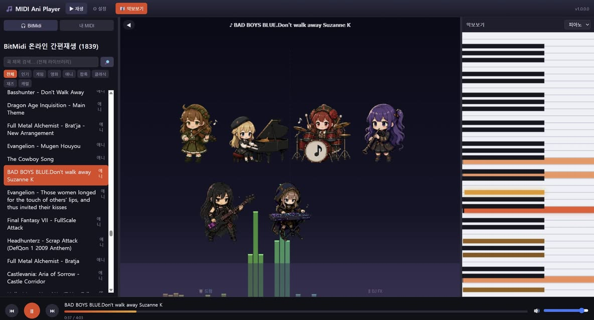
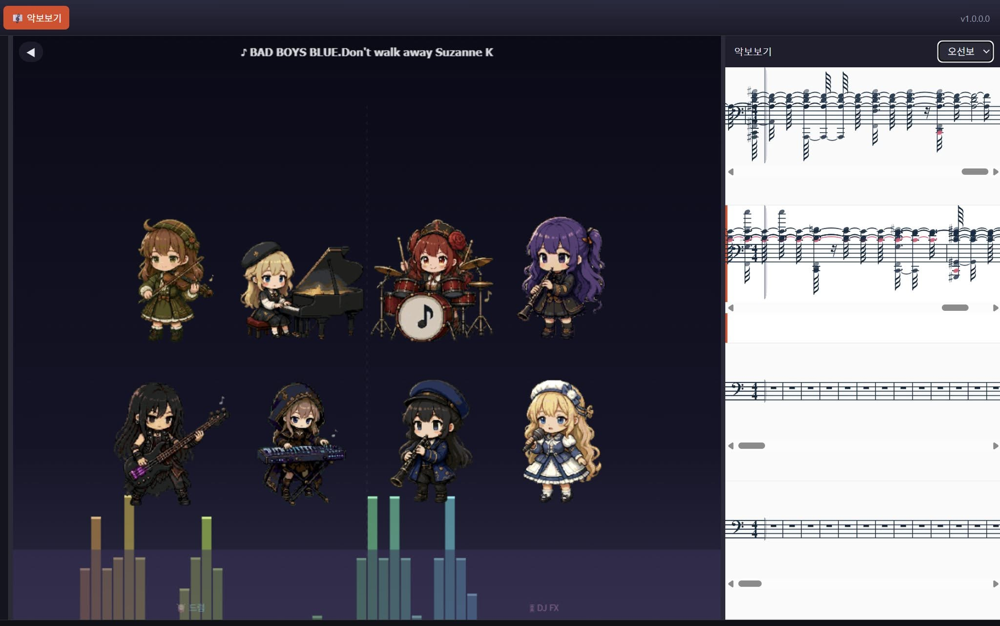

# MIDI Ani Player — NAS App



DeskWeb의 MIDI Player를 **NAS 전용 웹 앱**으로 떼어낸 프로젝트.
악단 애니메이션 · 피아노 건반 · 오선보 · 드럼 잼을 갖춘 MIDI 플레이어를, NAS 폴더/네트워크 공유의 `.mid` 파일로 웹에서 재생한다.
▶ **라이브 데모**: [https://midi.webnori.com/](https://midi.webnori.com/) · 🐳 Docker Hub: [`psmon/midiplayer`](https://hub.docker.com/r/psmon/midiplayer)

- **백엔드**: .NET 10 Native AOT 단일 바이너리 `midi-ani-player` (linux-x64 / linux-arm64).
  정적 UI(`www/`) 서빙 + NAS 파일 접근 API + BitMidi 검색 프록시.
- **프론트**: React + Vite + TS (`www/`로 빌드).
- **패키징**: UGREEN **UGOS UPK** (`is_docker_app: false`), app_id `com.webnori.midiplayer`. 시놀로지는 이후.
- **재생 엔진**: SpessaSynth(Real, 로컬 SF3) 기본 + html-midi-player(simple) — 자산 자체 호스팅(오프라인), BitMidi 온라인 검색.

> 상세 설계: `../` 저장소 계획 문서 참조. 원본 위젯: `../deskweb/source/class/deskweb/ui/MidiPlayerWindow.js`.

## 주요 기능 ✅ (브라우저 실측 완료)

- 🎭 **악단 애니메이션** — 곡의 GM 악기별 연주자 스프라이트 + 64bin 스펙트럼(canvas).
- 🎹 **피아노 건반** — 재생 노트에 맞춰 세로 건반이 타격되는 canvas 연출(악보 기본 모드).
- 🎼 **오선보(5선) 악보** — 페이지 윈도잉으로 여러 줄을 세로 스크롤(대곡도 경량).
- 🥁 **드럼 잼(멀티터치)** — 무대를 눌러 드럼: **왼쪽 드럼킷 / 오른쪽 DJ FX**, 손가락별 동시 타격.
- 🎧 **BitMidi 내장** — 사전 분류 카탈로그 1839곡(8장르) + 실시간 검색, 파일 없이 스트리밍.
- ❤️ **좋아요** — 곡 하트로 즐겨찾기 목록 저장.
- ⏮⏭ **이전/다음 + 자동 다음곡**, 재생목록 접기/펼치기, 패널 리사이즈.
- 📁 **NAS 폴더** — 마운트 또는 **설정에서 SMB 공유 직접 추가**(OS 마운트 불필요).
- 📱 **모바일 반응형** — 유튜브뮤직식(목록→악단 메인), iOS 오디오 언락.
- **패키징**: 실제 서명 `.upk`(ugcli) + Docker Hub `psmon/midiplayer` 배포.



미이식(선택): simple 엔진(html-midi-player 재생, SGM_plus 사운드폰트 이슈) · 주크박스 스킨(장식).

## 구조

```
backend/    .NET 10 AOT (ASP.NET Core Minimal API) — Program.cs, Services/, Models/, AppJsonContext.cs
frontend/   React + Vite + TS — src/{api,engines,components,...}, public/vendor/(자체호스팅 자산)
packaging/  project.yaml + rootfs_{amd64,arm64}/bin + rootfs_common/{icon.png,www}
scripts/    fetch-assets.sh · build.sh · pack-upk.sh
```

## 개발 (로컬)

```bash
# 1) 자체 호스팅 자산(사운드폰트 ~8MB) 내려받기 — 최초 1회
bash scripts/fetch-assets.sh

# 2) 백엔드 실행 (기본 포트 29090). MIDI_ROOTS로 접근 허용 폴더 지정.
cd backend
MIDI_ROOTS="/path/to/midi-folder" dotnet run
#   Windows PowerShell: $env:MIDI_ROOTS="D:\midi"; dotnet run

# 3) 프론트 개발 서버 (/api → 백엔드로 프록시)
cd ../frontend
npm install
npm run dev        # http://localhost:5173
```

### 환경 변수 (백엔드)

| 변수 | 기본값 | 용도 |
|---|---|---|
| `MIDI_PORT` | `29090` | Kestrel 리슨 포트 (0.0.0.0) |
| `MIDI_ROOTS` | `<data>/music` | 접근 허용 루트 폴더들 (`;` 구분) — path-jail 경계 |
| `MIDI_DATA_DIR` | `<bin>/data` | settings.json 저장 위치 |
| `MIDI_WWW` | `<bin>/../www` → `<bin>/www` | 정적 UI 경로 override |

## 빌드 & 패키징

**옵션 A — Docker만으로 (권장, OS 무관)**: 로컬에 .NET/Node/clang 불필요.
```bash
bash scripts/build-docker.sh amd64   # UI + AOT(x64) → packaging/rootfs_amd64
bash scripts/build-docker.sh arm64   # arm64 (QEMU 에뮬 또는 arm64 호스트)
```

**옵션 B — 로컬 툴체인(Debian 12)**:
```bash
bash scripts/build.sh amd64          # UI + AOT(x64)
bash scripts/build.sh arm64          # UI + AOT(arm64)
```

**UPK 팩** (ugcli 필요 — UGREEN 개발자 포털에서 설치):
```bash
cd packaging && ugcli pack --build 1  # → {arch}_com.webnori.midiplayer_1.0.0.0001.upk
```

### CI/배포 분리 (태그 네임스페이스)

| 대상 | 트리거 | 워크플로 | 방식 |
|---|---|---|---|
| **Docker Hub 이미지** | `midiplayer-v*` 태그 | `../.github/workflows/docker-publish.yml` | **자동** — amd64+arm64 네이티브 빌드 → **멀티아치 매니페스트 push** (`psmon/midiplayer:<ver>` + `latest`). 이미 게시된 버전이면 실패(충돌 방지). |
| **NAS / UGOS UPK** | — | `nas-app-release.yml` (`workflow_dispatch` 수동) | **로컬 우선** — `scripts/build.sh` + `pack-upk.sh`. 태그 자동빌드 비활성화. |
| DeskWeb Pages | `v*` 태그 | `deploy-pages.yml` | (별개 앱) |

> Docker 릴리스: main 커밋에 `git tag midiplayer-v1.3.0 && git push origin midiplayer-v1.3.0`.
> 시크릿 필요: `DOCKERHUB_USERNAME`, `DOCKERHUB_TOKEN` (repo Settings → Secrets → Actions).

## 배포 경로 A — Docker / Container Manager (승인 불필요, 권장 테스트)

UPK·개발자 인증 없이 UGOS **Container Manager**(1st-party Docker)에서 바로 실행.
`docker save` 이미지 tar를 임포트하거나 레지스트리에서 pull → compose로 구동.

- 산출물: `docker/Dockerfile`, `docker/docker-compose.yaml`, 이미지 tar(`dist/midi-ani-player-1.0.0-amd64-image.tar`, 41MB).
- 로컬 검증 완료: 컨테이너 구동 → `/music` 바인드 마운트 102곡 스캔 → 재생·악단·악보 정상, 콘솔 에러 0.

NAS에서:
1. Container Manager에 이미지 tar 임포트(또는 레지스트리 pull) → `midi-ani-player:1.0.0`
2. `docker-compose.yaml`의 `/volume1/Music` 바인드 마운트를 실제 음악 폴더로 수정
3. compose로 프로젝트 생성·시작 → `http://<NAS-IP>:29090`

> **NAS 폴더 접근이 더 쉬움**: `ugdev.sig`/`UGAPP_SHARED_DIR` 인가 없이 폴더를 바인드 마운트만 하면 됨.
> arm64 NAS면 arm64 이미지 필요(`build-docker.sh arm64`로 빌드 후 buildx로 이미지 생성).

## 배포 경로 B — 네이티브 UPK (App Center, 개발자 인증 필요)

> 출처: developer.ugnas.com Backend 문서(네이티브 앱). 요약본은 `.e2e/docs/en/`.

1. **개발자 권한**: NAS를 UGOS Pro **1.13.0.0000+** 로 업데이트하고, UGREEN 공식 지원에 문의해 **해당 기기의 개발자 권한(authorization)** 을 받는다. (수동 설치의 필수 전제)
2. **빌드/팩**: `scripts/build.sh amd64 && scripts/build.sh arm64` → `cd packaging && ugcli pack --build 1`.
3. **수동 설치**: NAS의 **App Center → 수동 설치**로 `.upk` 업로드. 설치 후 데스크톱 아이콘으로 실행.
4. **로그**: `/var/packages/com.webnori.midiplayer/log/com.webnori.midiplayer.log` (stdout/stderr 리다이렉트).
5. **정식 배포**: 테스트 후 `.upk`를 UGREEN에 이메일로 제출 → 심사 통과 시 App Center 게시.

### UGOS 런타임 동작 (설계 반영됨)
- **www는 시스템 웹서버가 서빙**하고, 게이트웨이가 `/api/`(=`proxy_path`) 요청만 우리 백엔드 `port`로 포워딩한다. → 프론트의 `/api/*` 호출이 백엔드로 도달. (우리 백엔드의 정적 서빙은 dev/독립실행용)
- 프로세스 **작업 디렉토리 = 앱 data 디렉토리** (`/volume{n}/@appdata/{app_id}`). 백엔드는 여기에 `settings.json` 저장.
- 시스템이 `port` 접속 가능 여부로 기동 성공을 판정. 종료 시 **SIGTERM**(10초 내 graceful exit 권장).
- `open_type: inner` → UGOS 데스크톱 내 독립 창(JSSDK로 NAS 사용자 인증 연동 가능).
- 설치 경로: `/volume{n}/@appstore/{app_id}` ( `bin/`, `www/`, `data/`, `log/`, `icon.png` ).

### NAS 폴더 접근 (UGOS 메커니즘)
`project.yaml`에 `allow_add_access_path: true` 선언 → 사용자가 **UGOS 앱 설정 화면**에서 폴더를 인가하면
`$UGAPP_SHARED_DIR` 아래에 심볼릭 링크로 노출된다. 백엔드는 이 디렉토리의 항목들을 자동으로 접근 루트로 삼는다
(코드: `SharedRoots()`). 앱 내 설정의 "폴더 찾아보기"는 dev/독립실행용 폴백(샌드박스에선 제한됨).
인터넷(BitMidi)은 `permissions: [NETWORK.ACCESS_INTERNET]` 선언으로 허용.

## 남은 작업 (배포 전)

- **악보보기(스코어)** · **simple 엔진(html-midi-player)** · **주크박스 스킨** — html-midi-player/magenta 벤더링 묶음(다음 배치).
- simple 엔진용 Magenta SGM_plus 사운드폰트 로컬 미러링(용량) 여부.
- **`proxy_path` 프리픽스 스트립 여부** — 게이트웨이가 `/api` 프리픽스를 백엔드에 유지해 전달하는지 첫 설치 시 로그로 확인.
- **완료**: 워킹 스켈레톤 · 악단 애니 · NAS 폴더 접근(UGAPP_SHARED_DIR) · BitMidi 검색 · 시크바 · 볼륨 · icon.png · UGOS 네이티브 project.yaml.

## 보안 메모

모든 파일 접근은 `FileBrowser`의 **path-jail**을 통과해야 한다 — 클라이언트 경로를 realpath로 정규화하고 허용 루트 하위인지 검증(`..`/심볼릭 탈출 거부). BitMidi 파일 프록시는 `bitmidi.com` 호스트만 화이트리스트. 이 경계를 약화시키지 말 것.
